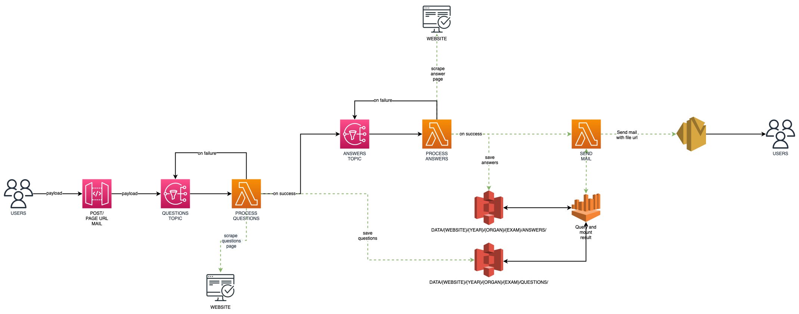

# Magnifier Concourse Scrape

  

This project is a crawler/scraper to collect multiple data from webpages using Serverless Architecture.

## Prerequisites
// TODO

## Service diagram

  

## Installing
// TODO

## Execute Local
// TODO

## Deploy it in AWS
// TODO

## Contributing
// TODO

## Contributors

Thanks to the following people who have contributed to this project:

- [@malaquiasdev](https://github.com/malaquiasdev)

## Contact

If you want to contact me you can reach me at <mateusmalaquiasdev@outlook.com>.